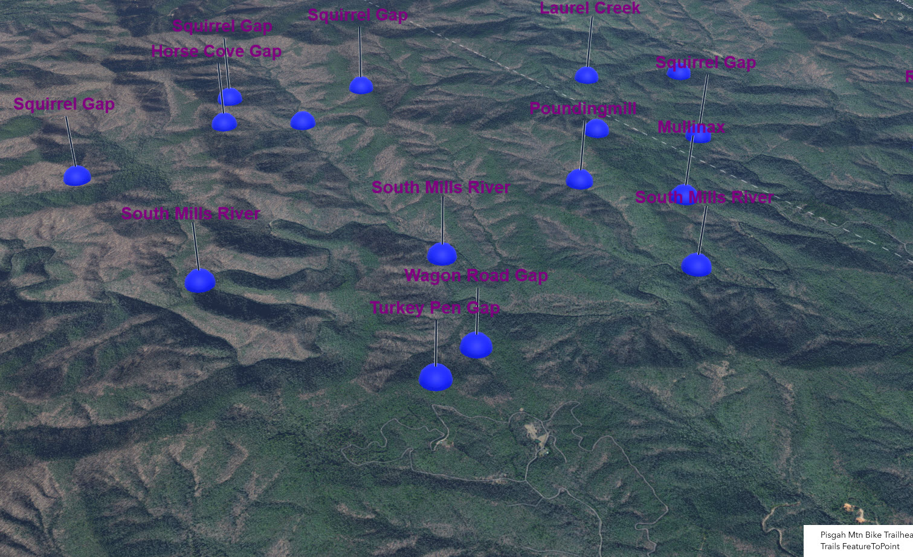

<!-- Improved compatibility of back to top link: See: https://github.com/othneildrew/Best-README-Template/pull/73 -->
<a id="readme-top"></a>
<!--
*** Thanks for checking out the Best-README-Template. If you have a suggestion
*** that would make this better, please fork the repo and create a pull request
*** or simply open an issue with the tag "enhancement".
*** Don't forget to give the project a star!
*** Thanks again! Now go create something AMAZING! :D
-->


<!-- PROJECT SHIELDS -->
<!--
*** I'm using markdown "reference style" links for readability.
*** Reference links are enclosed in brackets [ ] instead of parentheses ( ).
*** See the bottom of this document for the declaration of the reference variables
*** for contributors-url, forks-url, etc. This is an optional, concise syntax you may use.
*** https://www.markdownguide.org/basic-syntax/#reference-style-links
-->

[![Forks][forks-shield]][forks-url]
[![Unlicense License][license-shield]][license-url]
[![LinkedIn][linkedin-shield]][linkedin-url]


<!-- PROJECT LOGO -->
<br />
<div align="center">
  <a href="https://github.com/othneildrew/Best-README-Template">
    
  </a>
</div>
<br>
<br>

<!-- TABLE OF CONTENTS -->
<details>
  <summary>Table of Contents</summary>
  <ol>
    <li>
      <a href="#about-the-project">About The App</a>
      <ul>
        <li><a href="#built-with">Built With</a></li>
      </ul>
    </li>
    <li>
      <a href="#getting-started">Getting Started</a>
      <ul>
        <li><a href="#prerequisites">Prerequisites</a></li>
        <li><a href="#installation">Installation</a></li>
      </ul>
    </li>
    <!-- <li><a href="#usage">Usage</a></li> -->
    <!-- <li><a href="#roadmap">Roadmap</a></li>     -->
    <li><a href="#contact">Contact</a></li>
    <li><a href="#acknowledgments">Acknowledgments</a></li>
  </ol>
</details>


<!-- ABOUT THE PROJECT -->
## About The Application

Live version hosted on web server here: https://www.thepisgahgeographer.com/index_Arcgis.html

This app leverages the 3D scene environment and tooling within the JS SDK. It details mountain bike trailheads in western NC to run service area solves from a location created via user input. 

App works through the following concepts:
* Leveraging scene components
  - Serves as the 3D scene container for the application
* Utilizing core api functionality via the well-known require processes
* Creation of a 3D label class and 3D symbology for the feature layer point data.
* Creating and attaching event listener for changes on view state.
* Creation of a click event
  - Capturing a map point event and creating a graphic for it
* Definition of service area parameters
  - FeatureSet
  - Task parameters
* Running the solve 
  - Iteration over features to get the geometry of each
* Constructing and running a query
  - Performing the spatial query
  - Logging the intersection between the point geometry and drive-time polygons


<p align="right">(<a href="#readme-top">back to top</a>)</p>


### Built With

* [JavaScript]
* [ArcGIS Maps SDK for JS]

<p align="right">(<a href="#readme-top">back to top</a>)</p>


<!-- GETTING STARTED -->
## Getting Started

Multiple options exist for bringing the ArcGIS Maps SDK for JavaScript into your app. The most common way is to use the ArcGIS CDN. Files are downloaded via optimized cloud caching, and there is no need to build your application locally. It is also easier to update to a new version of the SDK because it doesn't require rebuilding the application every time.

### Prerequisites
When building applications with the ArcGIS Maps SDK for JavaScript, there are multiple options, each with their own advantages depending on your specific goals and requirements. For a small project, the ArcGIS Content Delivery Network (CDN) might be the best approach to get started. For larger or complex applications built with a modern JavaScript framework or build tool, installing component packages from npm is best practice.

Components from the ArcGIS Maps SDK for JavaScript are dependent on the Calcite Design System and the SDK's core API. You'll need to load Calcite and the core API first.

Using the ArcGIS CDN is a straightforward way to include the SDK's capabilities in your application without needing to install any packages locally. This is ideal for simple applications, quick prototyping, or when you want to leverage optimized cloud caching for faster module downloads.

If you're building a more complex application, especially within modern build tools or JavaScript frameworks like React, Vue, or Angular, then it is recommended to install the JavaScript Maps SDK via npm. This allows you to manage any packages as a dependency in your project, take advantage of npm's package management capabilities, and integrate more seamlessly with modern build tools like Webpack and Vite.

Each component package from the JavaScript Maps SDK is designed to be framework-agnostic, meaning they are compatible with most JavaScript frameworks or no framework at all.

### Installation


1. To use map components, install the @arcgis/map-components package and its dependencies into your project:
   ```sh
    npm install @arcgis/map-components
   ```
2. Create a Layout
   ```sh
   In your index.html file, add the arcgis-map component and reference the main.js file. Each component is a custom element that you add to your application using an HTML tag. They work just like any other HTML element such as a <div></div>.
   ```
3. Configure CSS
   ```sh
   Configure the CSS and import it in the main.js file. Specific examples are available for a variety of frameworks and module bundlers in the jsapi-resources GitHub repository.
   ```


<p align="right">(<a href="#readme-top">back to top</a>)</p>


<!-- USAGE EXAMPLES
## Usage

Use this space to show useful examples of how a project can be used. Additional screenshots, code examples and demos work well in this space. You may also link to more resources.

_For more examples, please refer to the [Documentation](https://example.com)_

<p align="right">(<a href="#readme-top">back to top</a>)</p> -->


<!-- ROADMAP
## Roadmap

- [x] Construct Scene View in SDK
- [x] 
- [ ] Add Additional Templates w/ Examples
- [ ] Add "components" document to easily copy & paste sections of the readme -->


<p align="right">(<a href="#readme-top">back to top</a>)</p>

<!-- CONTACT -->
## Contact

Yuri P - ypotawsky@gmail.com

Project Link: (https://github.com/thepisgahgeographer/ArcGIS_JS_SDK)

<p align="right">(<a href="#readme-top">back to top</a>)</p>


<!-- ACKNOWLEDGMENTS -->
## Acknowledgments

* [ArcGIS JS SDK](https://developers.arcgis.com/javascript/latest/) 
* [GitHub Pages](https://pages.github.com)
* [Font Awesome](https://fontawesome.com)
* [React Icons](https://react-icons.github.io/react-icons/search)

<p align="right">(<a href="#readme-top">back to top</a>)</p>


<!-- MARKDOWN LINKS & IMAGES -->
<!-- https://www.markdownguide.org/basic-syntax/#reference-style-links -->
<!-- [contributors-shield]: https://img.shields.io/github/contributors/othneildrew/Best-README-Template.svg?style=for-the-badge
[contributors-url]: https://github.com/othneildrew/Best-README-Template/graphs/contributors -->
[forks-shield]: https://img.shields.io/badge/-FORKS-black.svg?style=for-the-badge&logo=linkedin&colorB=555
[forks-url]: https://github.com/thepisgahgeographer/ArcGIS_JS_SDK/forks

<!-- 
[issues-shield]: https://img.shields.io/github/issues/othneildrew/Best-README-Template.svg?style=for-the-badge
[issues-url]: https://github.com/othneildrew/Best-README-Template/issues -->

[license-shield]: https://img.shields.io/badge/-ACTIONS-black.svg?style=for-the-badge&logo=linkedin&colorB=555
[license-url]: https://github.com/thepisgahgeographer/ArcGIS_JS_SDK/actions/new

[linkedin-shield]: https://img.shields.io/badge/-LinkedIn-black.svg?style=for-the-badge&logo=linkedin&colorB=555

[linkedin-url]: https://www.linkedin.com/in/yuri-potawsky-gis

[product-screenshot]: images/screenshot.png


[JavaScript]: https://developer.mozilla.org/en-US/docs/Web/JavaScript

[ArcGIS Maps SDK for JS]: https://developers.arcgis.com/javascript/latest/

